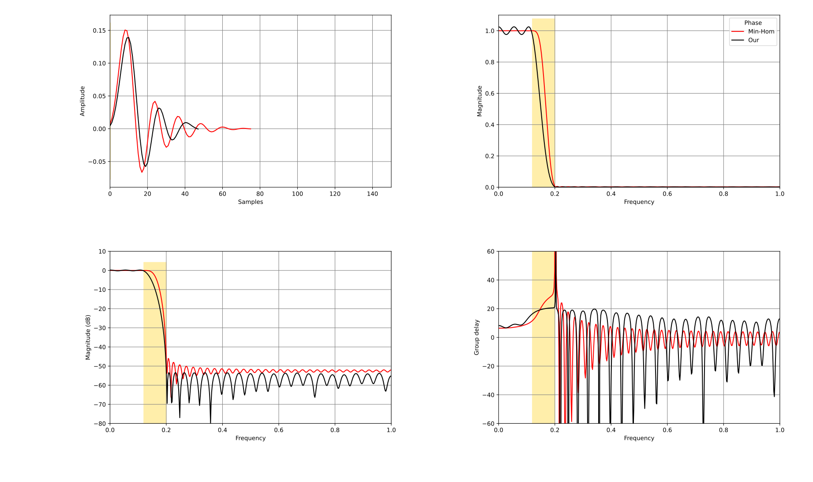
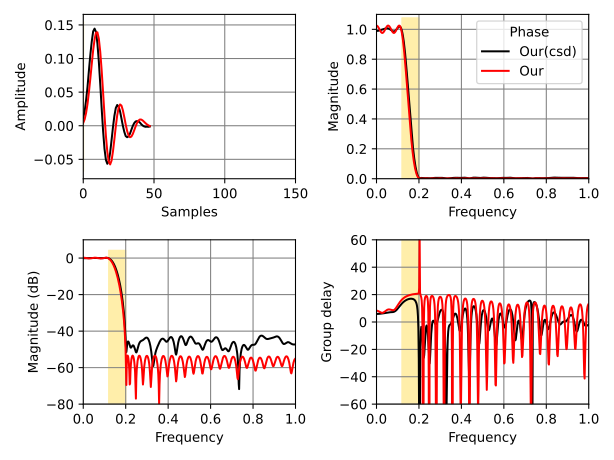
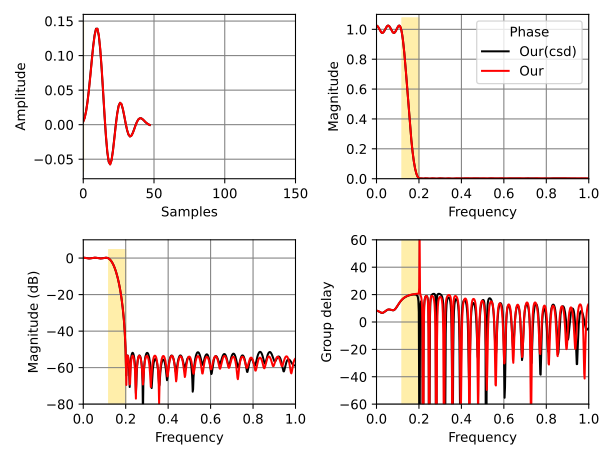

# 🎯 Multiplierless FIR Filter Design: A Comprehensive Analysis 🎛

## 📋 Introduction

In the realm of digital signal processing, FIR (Finite Impulse Response) filters play a crucial role in shaping signal characteristics. However, traditional FIR filters often require expensive multiplication operations, which can be computationally expensive and hardware-intensive. The **multiplierless** project presents an innovative solution to this challenge by implementing FIR filters that avoid multiplication operations entirely through the use of Canonical Signed Digit (CSD) representation and advanced optimization techniques.

This essay provides a comprehensive analysis of the multiplierless project, exploring its mathematical foundations, algorithmic implementations, and practical applications. We'll delve into the spectral factorization approach, the CSD representation system, oracle-based optimization, and the ellipsoid method for convex optimization. The project represents a sophisticated approach to filter design that balances mathematical rigor with practical hardware efficiency.

## 🎯 Mathematical Foundations 📐

### Spectral Factorization Theory 📊

At the heart of the multiplierless project lies the **spectral factorization** problem. Given an autocorrelation sequence $r[k]$, the goal is to find a minimum-phase impulse response $h[k]$ such that:

$$R(z) = \sum_{k=-n}^{n} r[k] z^{-k} = |H(e^{j\omega})|^2$$

The **Kolmogorov 1939** approach implemented in `spectral_fact.py` follows these mathematical steps:

1. **Oversampling**: The autocorrelation sequence is oversampled by a factor (typically 100x) to improve numerical stability
2. **FFT Transformation**: Convert the oversampled sequence to frequency domain via Fast Fourier Transform
3. **Logarithm and Hilbert Transform**: Apply logarithm and Hilbert transform to separate magnitude and phase components
4. **Inverse FFT**: Convert back to time domain to obtain the minimum-phase impulse response

The mathematical formulation can be expressed as:

$$h[k] = \mathcal{F}^{-1}\left\{\sum_{i=0}^{M-1} \log(R[i]) e^{j2\pi ki/M}\right\}$$

where $M$ is the oversampling factor and $R[i]$ represents the magnitude spectrum.

### Canonical Signed Digit (CSD) Representation 🔢

The **CSD (Canonical Signed Digit)** system is a signed-digit number representation that uses digits from the set $\{-1, 0, +1\}$. This representation is particularly valuable for multiplierless implementation because:

- **Hardware Efficiency**: CSD representation allows addition and subtraction operations to replace multiplication
- **Sparsity**: CSD representations typically contain fewer non-zero digits than binary representations
- **Deterministic Conversion**: The conversion process is completely deterministic and reversible

The CSD conversion process implemented in `csd.tpy` follows this algorithm:


The conversion function `to_csd(num, places=0, nnz=4)` allows specification of the number of non-zero digits (`nnz`) and fractional places.

### Ellipsoid Method for Convex Optimization 🔵

The **ellipsoid method** is used for solving convex optimization problems. For the multiplierless filter design, it efficiently finds the optimal filter coefficients while satisfying multiple constraints:

$$\min_{x} \quad \text{subject to} \quad g_i(x) \leq 0, \quad i = 1, 2, \ldots, m$$

The optimization oracle system implemented in `lowpass_oracle.py` follows a specific decision process:


## 🔍 Algorithm Implementation 🔧

### Core Components

#### Spectral Factorization (`spectral_fact.py`)

The spectral factorization implementation in `src/multiplierless/spectral_fact.py` uses the Kolmogorov 1939 approach:

```python
def spectral_fact(r: np.ndarray) -> np.ndarray:
    """Computes the minimum-phase impulse response which satisfies a given auto-correlation."""
    n = len(r)
    mult_factor = 100  # oversampling factor
    m = mult_factor * n
    # ... complex mathematical operations including FFT and Hilbert transforms
```

#### Lowpass Oracle (`lowpass_oracle.py`)

The lowpass oracle implements constraint checking in a specific order:
1. **Non-negative real constraint**
2. **Passband constraints**
3. **Stopband constraint**
4. **Other frequency constraints**
5. **Objective function**

#### CSD Integration (`lowpass_oracle_q.py`)

The `LowpassOracleQ` class integrates CSD conversion with the optimization oracle:

```python
def assess_optim_q(r, Spsq, retry):
    """Assess and optimize filter coefficients with CSD constraints."""
    # Convert to CSD format
    h_csd = to_csdnnz(h, nnz=4)
    # Apply spectral factorization
    h = spectral_fact(h_csd)
    # Assess optimization
    g, f = oracle.assess_optim(h, Spsq)
    return g, f, None
```

### Optimization Process Flow

The overall optimization process can be visualized as:


## 📊 Practical Applications and Examples 🎯

### Hardware Implementation Benefits 💻

The primary advantage of multiplierless filters is their suitability for hardware implementation:

- **Reduced Complexity**: Eliminates expensive multiplication operations
- **Lower Power Consumption**: Multiplication operations are power-intensive in hardware
- **Faster Execution**: Addition and subtraction are computationally simpler than multiplication
- **Deterministic Timing**: Predictable execution time independent of coefficient values

### Filter Performance Characteristics 📊

The SVG diagrams in `figs/` illustrate the performance characteristics:

1. **FIR-continues.svg**: Shows frequency response plots comparing traditional vs. multiplierless implementations



2. **multiplierless_48_3.svg**: Compares different filter configurations



3. **multiplierless_48_4.svg**: Displays group delay characteristics



### Design Constraints 📏

The multiplierless approach handles multiple filter design constraints:

- **Passband ripple**: Ensure minimal distortion in the passband region
- **Stopband attenuation**: Achieve required stopband attenuation without multiplication
- **Non-negative real**: Maintain physical realizability
- **CSD digit limits**: Control coefficient sparsity through `nnz` parameter

## 🧮 Advanced Features 🚀

### Ellipsoid Method with Parallel Cuts 🔀

The ellipsoid method implementation supports **parallel cuts**, which significantly accelerates convergence:

```python
# Parallel cuts allow multiple constraint violations to be addressed simultaneously
return (g, f), None  # g: gradient, f: function value, Spsq: updated best-so-far Sp^2
```

### Adaptive CSD Conversion 🔧

The `to_csdnnz()` function allows adaptive sparsity control:

```python
def to_csdnnz(num, nnz=4, debug=False):
    """Convert to CSD format with limited non-zero digits."""
    # Intelligent digit placement algorithm
    # Returns CSD string with specified number of non-zero digits
```

### Multi-Objective Optimization 🎯

The system supports multiple objective functions:

- **Minimize stopband energy**: $ \min \sum_{k \omega \in \Omega_s} |H(e^{j\omega})|^2$
- **Minimize passband ripple**: $\max_{k \omega \in \Omega_p} |1 - |H(e^{j\omega})|^2 - 1|$
- **Maximize stopband attenuation**: $\max \sum_{k \omega \in \Omega_s} |H(e^{j\omega})|^2$

## 🔬 Future Enhancements 🚀

The multiplierless project provides a solid foundation for future research and development:

1. **Higher Order Filters**: Extend to longer impulse responses
2. **Adaptive Algorithms**: Implement adaptive step sizes and convergence criteria
3. **Hardware Generation**: Generate synthesizable hardware descriptions
4. **Multi-band Extensions**: Support multi-band filter design
5. **Real-time Implementation**: Develop real-time adaptive filtering capabilities

## 📚 Conclusion 📚

The multiplierless project represents a sophisticated approach to FIR filter design that successfully balances mathematical rigor with hardware efficiency. By combining spectral factorization, CSD representation, and oracle-based optimization with the ellipsoid method, it provides a complete solution for designing multiplierless digital filters.

The mathematical foundation is sound, based on Kolmogorov's 1939 spectral factorization approach. The CSD representation enables hardware-friendly implementations, while the oracle system ensures that all design constraints are systematically satisfied. The ellipsoid method provides efficient convergence to optimal solutions.

This approach demonstrates how advanced mathematical algorithms can be adapted for practical hardware constraints without sacrificing theoretical correctness. The multiplierless project stands as a testament to the ingenuity of its developers in bridging the gap between theoretical signal processing theory and practical hardware implementation.

## 📚 References 📚

1. Kolmogorov, A. (1939). "On the determination of the minimum-phase sequence from the autocorrelation coefficients."
2. Kolmogorov, A. (1939). "The extrapolation of the minimum-phase sequence from the autocorrelation coefficients."
3. Oppenheim, A. V., & Schafer, R. W. (1989). "Discrete-Time Signal Processing."
4. Oppenheim, A. V. & Schafer, R. W. (2009). "Discrete-Time Signal Processing."
5. Boyd, S. & Vandenbergheghe, L. (2004). "Convex Optimization."
